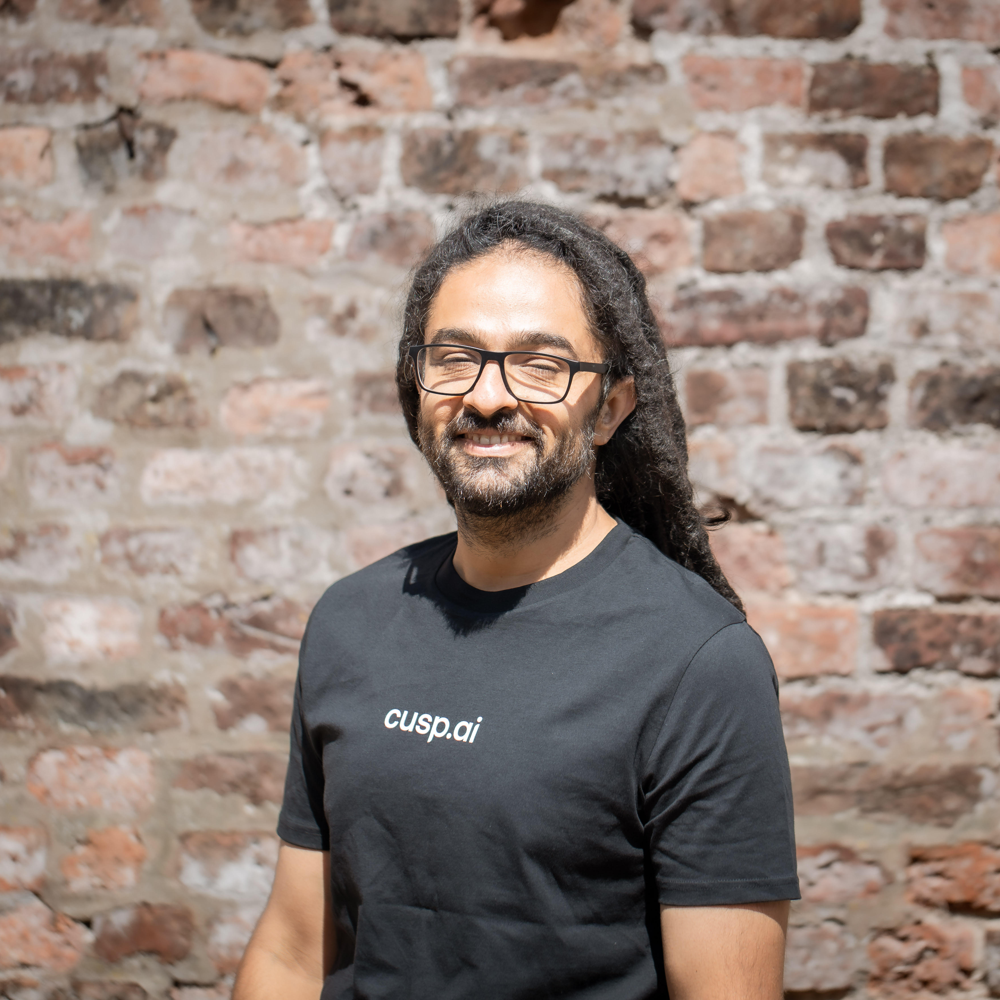

# Abstract

As Artificial Intelligence systems grow in complexity and scale, so do their environmental and societal impact. This workshop explores the urgent need for rethinking AI in terms of sustainability, with a focus on ecological and environmental issues. Presentations and discussions will rely on two pillars: 
*Sustainability in AI*, focused on reducing the ecological footprint of machine learning research and deployment, and *AI for Sustainability*, highlighting applications to global environmental challenges. With an emphasis on introspection of current practices, the workshop aims to foster responsible innovation, shared metrics, and encourage the community to design methods that are efficient, accessible, and viable with constrained resources.

# Schedule (not final)

| Time  |                 | Speaker |    |
| ----- | -------------------- | ------- | ----- |
| 08:30 | **Welcome**          | –       |  |
| 08:40 | **Speaker 1**        | Loïc Lannelongue| |
| 09:35 | **Speaker 2**        | [Claire Monteleoni](https://team.inria.fr/arches/claire-monteleoni/)| AI Research  for Climate Change and Environmental Sustainability |
| 10:30 | ☕ **Coffee Break**   | –       | |
| 11:00 | **Poster Spotlights** | –       |  |
| 11:30 | **Poster Session**   | –       |  |
| 12:30 | 🍽️ **Lunch**        | –       |  |
| 13:30 | **Speaker 3** | Bernd Ensing| |
| 14:00 | **Speaker 4** | Jan-Willem van de Meent| |
| 14:30 | **Speaker 5** | Sina Samangooei| The CuspAI Platform: Foundation Models, Search, and Agents for Materials Discovery |
| 15:00 | ☕ **Coffee Break**              | –              |  |
| 15:45 | 🎤 **Panel Discussion**         | All the speakers  |  |
| 16:45 | **Closing remarks**    | –              |  |

# Accepted papers

## 📑 Accepted Papers

| Type | Title | Authors |
|--------|---------|---------|
| Short | **Approximate Matrix Multiplication for Energy-Efficient Training of LLMs** | Nils Kasper, Anna Kazachkova, Rainer Schlosser, Ralf Herbrich | 
| Short | **Sustainable AI research? Researchers’ perceptions of the environmental impact of AI and emissions-feedback tools – a mixed methods study** | Theresa Willem, Marie Piraud | 
| Long | **xLSTM Scaling Laws: Competitive Performance with Linear Time-Complexity** | Maximilian Beck, Kajetan Schweighofer, Sebastian Böck, Sebastian Lehner, Sepp Hochreiter | 
| Short | **JumpLM - LLM Benchmarking and Interactive Performance Monitoring for higher GPU Utilization** | Lena Jurkschat, Anton Rygin, Elias Werner | 
| Short | **NA-LR: Noise-Adaptive Low-Rank Parameterisation for Efficient Diffusion Models** | Jingyuan Wang, Federico Ottomano, Yingzhen Li | 
| Long | **Cut Less, Fold More: Model Compression through the Lens of Projection Geometry** | Olga Saukh, Dong Wang, Haris Šikić, Yun Cheng, Lothar Thiele | 
| Long | **Quant-Trim in Practice: Improved Cross-Platform Low-Bit Deployment on Edge NPUs** | Rayen Dhahri, Steffen Urban | 
| Long | **Energy-Aware Benchmarking: A Case Study on Sampling Methods** | Anna Kazachkova, Johann Ukrow, Sven Köhler, Nicolas Alder, Rainer Schlosser, Ralf Herbrich | 
| Long | **KaVa: Latent Reasoning via Compressed KV-Cache Distillation** | Anna Kuzina, Maciej Pióro, Paul N. Whatmough, Babak Ehteshami Bejnordi | 
| Short | **Position: From Abundance to Frugality. Why the Future of Frontier AI Depends on Data Reduction** | Sophia N. Wilson, Raghavendra Selvan, Sebastian Mair | 
| Long | **Climate And Resource Awareness is Imperative to Achieving Sustainable AI (and Preventing a Global AI Arms Race)** | Pedram Bakhtiarifard, Pınar Tözün, Christian Igel, Raghavendra Selvan | 
| Long | **STaMP: Sequence Trasformation and Mixed Precision for Low-Precision Activation Quantization** | Marco Federici, Riccardo Del Chiaro, Boris van Breugel, Markus Nagel, Paul N. Whatmough | 
| Long | **xLSTM Distillation: Achieving Teacher-Student Parity Through Efficient Hybrid Architectures** | Lukas Hauzenberger, Niklas Schmidinger, Thomas Schmied, Anamaria-Roberta Hartl, David Stap, Pieter-Jan Hoedt, Sebastian Böck, Günter Klambauer, Sepp Hochreiter | 
| Long | **Optimizing Large Language Models: Metrics, Energy Efficiency, and Case Study Insights** | Tahniat Khan, Soroor Motie, Sedef Akinli Kocak, Shaina Raza | 
| Short | **The impacts of AI on environmental sustainability and human well-being** | Noemi Luna Carmeno, Daniel Walton O'Neill, Tiago Domingos | 
| Short | **Efficiency Will Not Lead to Sustainable Reasoning AI** | Philipp Wiesner, Daniel O'Neill, Francesca Larosa, Odej Kao | 
| Short | **Modelling the Doughnut of social and planetary boundaries with frugal machine learning** | Stefano Vrizzi, Daniel Walton O'Neill | 
| Long | **SpikeFit: Towards Optimal Deployment of Spiking Networks on Neuromorphic Hardware** | Ivan Kartashov, Mariia Pushkareva, Iakov Karandashev | 
| Long | **Energy Scaling Laws for Diffusion Models: Quantifying Compute and Carbon Emissions in Image Generation** |Aniketh Iyengar, Jiaqi Han, Boris Ruf, Vincent Grari, Marcin Detyniecki, Stefano Ermon  | 
| Long | **CacheSaver: A Modular Framework for Efficient, Affordable, and Reproducible LLM Inference** |Nearchos Potamitis, Lars Henning Klein, Bardia Mohammadi, Chongyang Xu, Attreyee Mukherjee, Laurent Bindschaedler, Niket Tandon, Akhil Arora  | 
| Long | **TiME: Tiny Monolingual Encoders for Efficient NLP Pipelines** | David Schulmeister, Valentin Hartmann, Lars Henning Klein, Robert West | 

# Important Dates

- **Submission Deadline:** ~~October 17th, 2025, 23:59 AoE~~
- **Accept / Reject notification:** ~~October 31st, 2025~~

# Submission link

Submissions will be managed through OpenReview: 
  - ~~<https://openreview.net/group?id=EurIPS.cc/2025/Workshop/RethinkingAI>~~ (*Submissions are closed*)
  - Note that newly created profiles on OpenReview *without an institutional email* will go through moderation process that *can take up to two weeks*. 

# Call for Voluntary Reviewers

We are currently seeking voluntary reviewers to assist in the evaluation of submissions. If you have relevant expertise and are willing to contribute your time and insights, please fill out our reviewer sign-up form: ~~<https://forms.gle/sVbzN9zs2UqyVc2n6>~~  
Reviewers must have an OpenReview account to participate. Your involvement will play a crucial role in ensuring the quality of the work presented at the workshop.

# Call for Contributions

We invite submissions to the **Rethinking AI** workshop, which will bring together researchers, practitioners, and policymakers to discuss the dual challenges of applying AI for environmental preservation and making AI itself more environmentally responsible.

The workshop will feature **two complementary tracks**:

## Track 1: Sustainability in AI

We aim to discuss the *environmental footprint of AI itself*. We encourage submissions that address:

- Measuring and reporting the carbon, energy, and water footprint of AI models
- Algorithmic and hardware efficiency (compression, pruning, quantization, frugal AI)
- Lifecycle impacts of AI infrastructure (training, deployment, hardware production and disposal)
- Socio-technical and governance perspectives on responsible AI development
- Position papers reflecting on current research norms and proposing strategies for sustainable AI practices

## Track 2: AI for Sustainability

We also welcome work that demonstrates how AI can contribute to tackling urgent environmental challenges. Submissions may include, but are not limited to, applications of machine learning for:

- Climate science and modeling
- Biodiversity monitoring and conservation
- Agriculture and food systems
- Renewable energy and grid optimization
- Sustainable urban planning and mobility
- Resource management and the circular economy

## Submission Guidelines

- We invite submissions of **novel and unpublished work**, as either **short papers** of at least 2 pages and up to 4 pages, or **long papers** of up to 9 pages. All page limits are excluding references and appendix. Submissions should follow [NeurIPS formatting style](https://neurips.cc/Conferences/2025/CallForPapers), the checklist can be optionally left out.
- **Published papers** can also be submitted in their original format, with the reviews included as supplementary material.
- We welcome *research papers, position papers, and case studies*. Accepted contributions are non-archival (not published in proceedings) and will be presented as posters, with selected works invited for short spotlight talks. We expect at least one author to present at the workshop.

# Speakers

<a href="https://www.lannelongue-group.org/" target="_blank">

 

Loïc Lannelongue <small>University of Cambridge</small>

</a>

<a href="https://team.inria.fr/arches/claire-monteleoni/" target="_blank">

 

Claire Monteleoni <small>Inria</small>

</a>

<a href="https://www.compchem.nl/staff_members/dr-ir-b-bernd-ensing" target="_blank">

 

Bernd Ensing <small>University of Amsterdam</small>

</a>

 

<a href="https://www.cusp.ai/" target="_blank">

 

Sina Samangooei <small>CuspAI</small>

</a>

<a href="https://jwvdm.github.io/" target="_blank">

 

<small>Jan-Willem van de Meent</small> <small>University of Amsterdam</small>

</a>

<a href="https://gael-varoquaux.info/" target="_blank">

 

Gaël Varoquaux <small>Inria</small>

</a>

# Organizers

<a href="https://qbouniot.github.io/" target="_blank">

 

Quentin Bouniot <small>TUM / Helmholtz Munich</small>

</a>

<a href="https://perso.telecom-paristech.fr/fdalche/" target="_blank">

 

Florence d'Alché-Buc <small>Télécom Paris</small>

</a>

<a href="https://enzotarta.github.io/" target="_blank">

 

Enzo Tartaglione <small>Télécom Paris</small>

</a>

<a href="https://www.eml-munich.de/people/zeynep-akata" target="_blank">

Zeynep Akata <small>TUM / Helmholtz Munich</small>

</a>

# Reviewers

We thank all reviewers for their efforts!

<!-- Anna Kuzina
Lukas Hauzenberger
Nikolaus Kopp
Leander Girrbach
Gabriele Spadaro
Olga Saukh
Victor Quétu
Gokul Srinath Seetha Ram
Pedram Bakhtiarifard
Anna Kazachkova
Stefano Vrizzi
Rayen Dhahri
Sushant Mehta
Eva Feillet
Marco Federici -->

| Anna Kuzina | Lukas Hauzenberger | Nikolaus Kopp | Leander Girrbach |
| Gabriele Spadaro | Olga Saukh | Victor Quétu | Gokul Srinath Seetha Ram |
| Pedram Bakhtiarifard | Anna Kazachkova | Stefano Vrizzi | Rayen Dhahri | 
| Sushant Mehta | Eva Feillet | Marco Federici | |

# Sponsors

<a href="https://elias-ai.eu/" target="_blank">

</a>

*This project has received funding from the European Union’s Horizon Europe research and innovation programme under grant agreement No. 101120237 (ELIAS).*  

# Contact  

For any inquiry, you can reach out to: <rethinking-ai-workshop@googlegroups.com>

